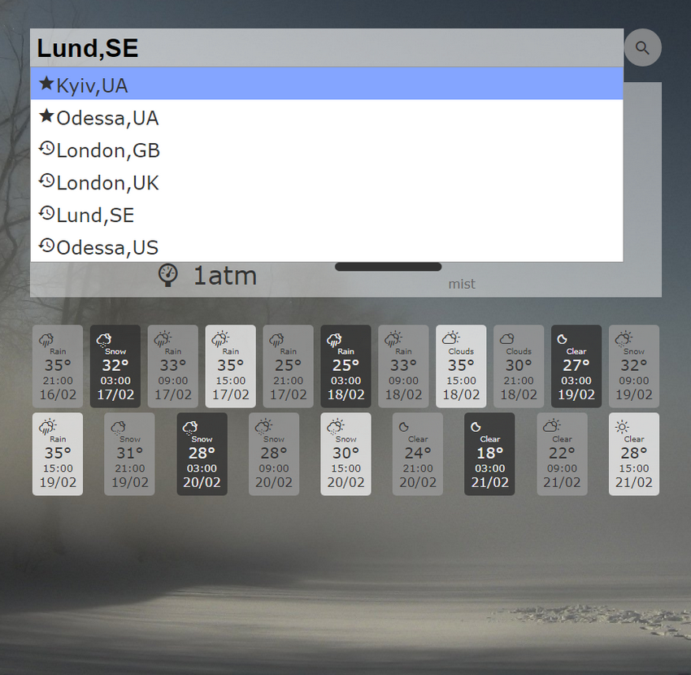

# Weather Web App

Basic [weather web app](https://oleksiyrudenko.github.io/weather-webapp/) employing public API.

Developed as a part of 
[Task 10 of Kottans FrontEnd Course](https://github.com/kottans/frontend/blob/master/test10.md)

<!-- START doctoc generated TOC please keep comment here to allow auto update -->
<!-- DON'T EDIT THIS SECTION, INSTEAD RE-RUN doctoc TO UPDATE -->
## Table of Contents

- [Features](#features)
- [Known Issues](#known-issues)
- [Installing and building the project](#installing-and-building-the-project)
- [Deployment](#deployment)
- [Resources](#resources)
- [Time Track](#time-track)

<!-- END doctoc generated TOC please keep comment here to allow auto update -->

### Features

 * Search by City name
 * Search by geo coordinates
 * Current weather and 5 days forecast
 * 20 latest cities searched are available in history track
   (stored per browser)
 * Switch between imperial and metric units
   (stored per browser)
 * [Open Weather Map](https://openweathermap.org/api) is a weather
   data source

[App architecture](./architecture.md)

[_-- TOC --_](#table-of-contents)

### Known Issues

 - [ ] Styling is poor
 - [ ] Forecast data removal is done not via style management
 - [ ] Current location not detected
 - [ ] Pre-loaded city list is not used
 - [ ] Favourites management is not implemented
 - [ ] Favourites drop-down is not implemented
 - [ ] Search by geo coordinates is not validated
 - [ ] Search errors are technical in style
 - [ ] Units switch doesn't update current data

[_-- TOC --_](#table-of-contents)

### Installing and building the project

Refer to [building the project](./BUILD.md) for more details.

[_-- TOC --_](#table-of-contents)

### Deployment

**Deploy to github pages, untracked `dist/` only**
using [push-dir](https://www.npmjs.com/package/push-dir)

`yarn global add push-dir` or `npm install --global push-dir` once

`push-dir --dir=dist --branch=gh-pages --cleanup --verbose`

[_-- TOC --_](#table-of-contents)

### Resources

 * [Autocomplete API](https://serbian.wunderground.com/weather/api/d/docs?d=autocomplete-api)

[_-- TOC --_](#table-of-contents)

### Time Track

 * `TOTAL= 28h25`
 * `171222 00h10` - setup
 * `171222 00h20` - initial research
 * `171223 01h35` - app architecture design
 * `171224 03h20` - view
 * `171224 01h50` - unit switch controller and settings service
 * `171224 00h20` - storage service
 * `171224 05h00` - city list feature
 * `180102 00h45` - research on `webpack`
 * `180103 01h40` - storage.put progress controller
 * `180103 03h55` - feature:search _(UI management took 2hrs of efforts)_
 * `180104 06h10` - feature:weather
 * `180110 02h40` - feature:history
 * `180113 00h40` - feature:url: query and browser history 

[_-- TOC --_](#table-of-contents)
