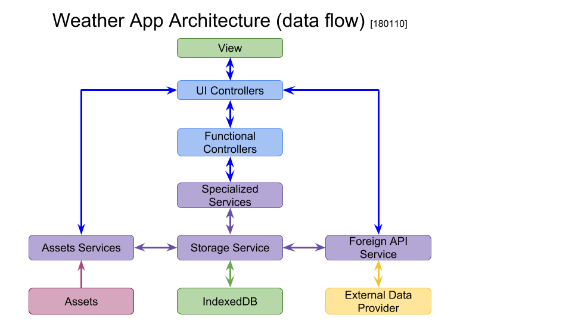

# Application Architecture

<!-- START doctoc generated TOC please keep comment here to allow auto update -->
<!-- DON'T EDIT THIS SECTION, INSTEAD RE-RUN doctoc TO UPDATE -->
**Table of Contents**

- [Intro](#intro)
- [Framework](#framework)
- [Bootstrapping](#bootstrapping)
- [Specialized App Components](#specialized-app-components)
  - [Services](#services)
  - [UI Controllers](#ui-controllers)
  - [Functional Controllers](#functional-controllers)
- [External Data Providers](#external-data-providers)
- [Principal App Architecture](#principal-app-architecture)

<!-- END doctoc generated TOC please keep comment here to allow auto update -->

## Intro

App comprises:
- View
- UI Controllers
- Functional Controllers
- Services
- Proprietary Data Providers
- Assets

View Elements are managed by UI Controllers only.
Functional Controllers are app component bootstrappers and
activity medias.

Controllers may interact with other Controllers and Services.
Services respond to data requests from Controllers and other Services
and store data supplied by Controllers.

Services employ Data Providers and external services
like `IndexedDB`, `localStorage`, foreign resources
over API, static and/or non-persistent sources.

Assets should be employed by Services. In this application assets
(imagery) employed by UI Controllers.

[_-- TOC --_](#table-of-contents)

## Framework

`AppComponent` is an abstract class featuring properties and methods
common for all components (Services, Controllers)

`AppServiceComponent` is an abstract class featuring properties
and methods common for all Services.

`AppControllerComponent` is an abstract class featuring properties
and methods common for all Controllers (Functional or general use
controllers and their derivatives).

`AppUiControllerComponent` is an abstract class featuring properties
and methods specific to Controllers managing View elements.

[_-- TOC --_](#table-of-contents)

## Bootstrapping

`AppController` is a Functional Controller that bootstraps the App:
 - consumes global configuration object
 - creates required components
 - supplies components with configuration and dependencies
 - supplies UI Controllers with immediate references to View elements

[_-- TOC --_](#table-of-contents)

## Specialized App Components

### Services

 * `CityHistoryService` - gets item to store, returns list of searched cities
 * `CityListService` - supplies city names for autocomplete
 * `FavCityService` - gets item to store, returns list of favourite cities
 * `SettingsService` - gets and returns app settings (e.g. Units) per browser
 * `StorageService` - interface to browser's `IndexedDB`
 * `WeatherService` - serves requests for weather forecasts;
   fetches results from foreign data provider over API

[_-- TOC --_](#table-of-contents)

### UI Controllers

 * `CityInputController` - manages user input, launches search
 * `GuideController` - provides for guiding tips
 * `FavCityController` - manages favourite cities user interaction
 * `MoodController` - updates mood media based on weather conditions
 * `ProgressController` - updates progress on data load
 * `SearchHistoryController` - manages search history view
 * `UnitSwitchController` - manages units switch
 * `WeatherController` - displays weather

[_-- TOC --_](#table-of-contents)

### Functional Controllers

 * `UrlController` - manages URL requests and browser history

[_-- TOC --_](#table-of-contents)

## External Data Providers

The App employs [Open Weather Map](https://openweathermap.org/api)
to deliver weather information.

[_-- TOC --_](#table-of-contents)

## Principal App Architecture

**Diagram legend**

 * Green box - browser feature
 * Blue box - App Controller
 * Purple box - App Service
 * Yellow box - external service
 * Magenta box - assets

Bootstrappers are not shown as those interact with every component
on app and/or component initialization.

[_-- TOC --_](#table-of-contents)
